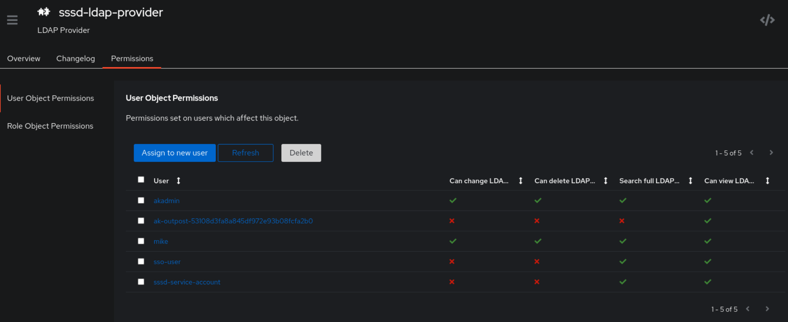

## The goal
The end-goal for this setup is to have Authentik running and providing LDAP so that I can tie some of my Servers and VMs to central auth via SSSD.  While Authentik has some good guides on this, I found there were some gaps for my particular setup.  We'll walk you through the full setup.

## Assumptions
I'm making the following assumptions on this post:
1) You have a working kubernetes cluster
1) You have a basic understanding of kubernetes resources and working with helm
1) You have a basic understanding of certificates and PKI
1) You have a basic understanding of SSSD and LDAP (not very important, but helps when we go into host-specific configuration)
1) You have read through, and have a very basic grasp of [Authentik Terminology](https://docs.goauthentik.io/docs/terminology).
1) You're using Traefik as an ingress controller.
    - You dont have to be, but you'll need to figure out how to get LDAP (389) and LDAPS (636) into the cluster pointed at the LDAP Outpost Service

## Self-signed CA
I've detailed my [certificate authority setup before](/posts/giteadroneselfsignedtls/). This is using that same [SmallStep CA](http://smallstep.com/) deployed via helm to the cluster.

Additionally, I'm using [Emberstack's Kubernetes Reflector](https://github.com/emberstack/kubernetes-reflector/) to mirror the `ConfigMap` containing my CA chain to the other namespaces (in this case, the `authentik` namespace).

If you want to use your own certificate authority (even one outside k8s), you can follow this tutorial simply understanding that you'll need your root certificate authority in a `ConfigMap`.  All of the examples will reference the `root_ca.crt` key in the `internalca-step-certificates-certs` configMap, but you can replace it with whatever you need.

For reference, my `ConfigMap` looks something like this:
```yaml
apiVersion: v1
kind: ConfigMap
metadata:
  annotations:
    reflector.v1.k8s.emberstack.com/auto-reflects: "True"
    reflector.v1.k8s.emberstack.com/reflected-at: '"2025-02-05T02:56:37.3235969+00:00"'
    reflector.v1.k8s.emberstack.com/reflected-version: "708137844"
    reflector.v1.k8s.emberstack.com/reflects: default/internalca-step-certificates-certs
  creationTimestamp: "2025-02-05T02:56:37Z"
  name: internalca-step-certificates-certs
  namespace: authentik
data:
  intermediate_ca.crt: |
    -----BEGIN CERTIFICATE-----
    MIIB.................
    -----END CERTIFICATE-----
  root_ca.crt: |
    -----BEGIN CERTIFICATE-----
    MIIB...................
    -----END CERTIFICATE-----

```

## Deploying Authentik
Authenik is a simple helm install away.  

```bash
# make sure you're pointed at the right cluster!
helm repo add authentik https://charts.goauthentik.io
helm repo update
helm upgrade --install authentik-dev authentik/authentik -f override.yml -n authentik --create-namespace
```

And the `override.yml`:
```yaml
authentik:
  secret_key: "1234"
  # This sends anonymous usage-data, stack traces on errors and
  # performance data to sentry.io, and is fully opt-in
  error_reporting:
    enabled: true
  postgresql:
    password: "asdf"

server:
  ingress:
    ingressClassName: traefik
    enabled: true
    hosts:
      - sso-dev.zeroent.lab
    annotations:
      traefik.ingress.kubernetes.io/router.entrypoints: websecure                                                                                                                           
      traefik.ingress.kubernetes.io/router.tls.certresolver: internalacme
    tls:
      - hosts:
          - sso-dev.zeroent.lab

postgresql:
  enabled: true
  auth:
    password: "asdf"
redis:
  enabled: true
```

For more information, checkout [Authentik's kubernetes installation guide](https://docs.goauthentik.io/docs/install-config/install/kubernetes).

## Deploying LDAP app, provider, and outpost
I'm not going to walk through in painful detail each step for deploying an LDAP Outpost, but simply link to the documentation and annotate where you'll maybe want to vary slightly.  The biggest recommendation is just **don't skim** the docs. Read **every step**, and do it.  That is what bit me the most.

Start off by [creating an LDAP Provider](https://docs.goauthentik.io/docs/add-secure-apps/providers/ldap/generic_setup).

- The first notice on that docs page says:
> Note: The default-authentication-flow validates MFA by default, and currently everything but SMS-based devices and WebAuthn devices are supported by LDAP. If you plan to use only dedicated service accounts to bind to LDAP, or don't use SMS-based authenticators, then you can use the default flow and skip the extra steps below and continue at Create LDAP Application & Provider

  - I highly recommend using a dedicated service account for LDAP binding, so this should not apply.  This means you can skip the entire `LDAP Flow` section of the docs.

- When creating the "New Application", on the "Provider Type" screen, set both Bind mode and Search Mode to `Direct` instead of `Cached`.
  - This will make troubleshooting a lot easer when you're making config changes and doing LDAP queries to test.
  - You can change these settings back to `Cached` as appropriate for your environment once everything is working

## Editing the LDAP outpost deployment
If you don't make any changes when creating the LDAP outpost, you'll notice it never successfully deploys.  Thats because it can't connect to your Authentik API, because it doesn't trust the CA that signed the cert for your ingress!


Well, it turns out, that if you drop any cert in `/etc/ssl/certs`, the golang ssl library (which the LDAP outpost uses) will just scoop those up and add them to the trust store!

But the LDAP outpost is getting deployed by Authentik directly, so how do we do that?  You *could* deploy it manually, but that sounds dumb, I want Authentik to manage it (with upgrades, etc).  

Well thankfully Authentik thought folks might want to tweak the pods/deployments of the outposts.  In the outpost configuration page, under the `Advanced` drop down, you can add a RFC 6902 compliant patch under the `kubernetes_json_patches` key, and voila!

```yaml
kubernetes_json_patches:
  deployment:
    - op: add
      path: /spec/template/spec/containers/0/volumeMounts
      value: []
    - op: add
      path: /spec/template/spec/containers/0/volumeMounts/-
      value:
        name: internalca-step-certificates-certs
        subPath: root_ca.crt
        readOnly: true
        mountPath: /etc/ssl/certs/acme-root.crt
    - op: add
      path: /spec/template/spec/volumes
      value: []
    - op: add
      path: /spec/template/spec/volumes/-
      value:
        name: internalca-step-certificates-certs
        configMap:
          name: internalca-step-certificates-certs
          defaultMode: 420

```
Now the outpost spins up with your CA chain mounted in the container, and successfully connects!

## Exposing the LDAP ports outside the cluster
> Note, this section assumes you have Traefik deployed with Helm.  If you used another deployment method, you'll need to either adapt this section to your traefik install, or find another way (`LoadBalancer` service, potentially) to get the LDAP traffic into your cluster (and pointed at the LDAP Outpost `ClusterIP` Service)
I'm using Traefik so I'll leverage the `IngressRouteTCP` CR that allows for arbritrary TCP and UDP traffic to be sent into the cluster.

First, I'll need to update my deployment of Traefik to create the new entrypoints.  Relevant section of my helm values for Traefik v2.10.4 (helm chart `v23.2.0`):

```yaml
ports:
  ldap:
    expose: true
    exposedPort: 389
    port: 3389
    protocol: TCP
  ldaps:
    expose: true
    exposedPort: 636
    port: 6636
    protocol: TCP
```

Then, I'll need to create some `IngressRouteTCP` resources:

```yaml
apiVersion: traefik.containo.us/v1alpha1
kind: IngressRouteTCP
metadata:
  name: sso-dev-ldap

spec:
  entryPoints:
    - ldap
  routes:
  - match: HostSNI(`*`)
    services:
    - name: ak-outpost-ldap-outpost-1
      port: 389
---
apiVersion: traefik.containo.us/v1alpha1
kind: IngressRouteTCP
metadata:
  name: sso-dev-ldaps

spec:
  entryPoints:
    - ldaps
  routes:
  - match: HostSNI(`*`)
    services:
    - name: ak-outpost-ldap-outpost-1
      port: 636
```

## Testing with `ldapsearch`
You can test authentication, binding, and LDAP queries with `ldapsearch`. Below is an example query (and response):
```
LDAPTLS_REQCERT=never ldapsearch -x -H ldaps://sso-dev.zeroent.lab -D "cn=sssd-service-account,ou=users,dc=ldap,dc=goauthentik,dc=io" -w "123456" -b "ou=users,dc=ldap,dc=goauthentik,dc=io" "(cn=mike)"


# extended LDIF
#
# LDAPv3
# base <ou=users,dc=ldap,dc=goauthentik,dc=io> with scope subtree
# filter: (cn=mike)
# requesting: ALL
#

# mike, users, ldap.goauthentik.io
dn: cn=mike,ou=users,dc=ldap,dc=goauthentik,dc=io
ak-superuser: TRUE
name: Mike
displayName: Mike
objectClass: top
objectClass: person
objectClass: organizationalPerson
objectClass: inetOrgPerson
objectClass: user
objectClass: posixAccount
objectClass: goauthentik.io/ldap/user
ak-active: TRUE
memberOf: cn=authentik Admins,ou=groups,dc=ldap,dc=goauthentik,dc=io
memberOf: cn=generic users,ou=groups,dc=ldap,dc=goauthentik,dc=io
sAMAccountName: mike
uidNumber: 2007
homeDirectory: /home/mike
sn: Mike
cn: mike
uid: 169160db3b2498c4b4a9b8f33cec5e11bb0fed8b98fe9097cd33eeb15dcfdb30
mail: mike@zeroent.net
gidNumber: 2007

# search result
search: 2
result: 0 Success

# numResponses: 2
# numEntries: 1
```
The above query using the following parameters:
- a service account of `sssd-service-account` was created in Authentik, and granted `Search full LDAP directory` permissions in the LDAP provider you created

- The password to that service account is `123456` (Dont actually do this!)
- You kept the default ldap scope of `dc=ldap,dc=goauthentik,dc=io` in the guide for setting up LDAP.
- You'll see we're disabling TLS verification with `LDAPTLS_REQCERT=never`, more on that [in **Future work**](#future-work).

## Configuring SSSD
Once you've finished verifying LDAP works, it's time to configure SSSD!

I'm using Rocky Linux so it's as simple as
```bash
sudo dnf install -y sssd
```

Setup the configuration file `/etc/sssd/sssd.conf`:
```conf
[nss]
filter_groups = root
filter_users = root
reconnection_retries = 3

[sssd]
config_file_version = 2
reconnection_retries = 3
domains = ldap.goauthentik.io
services = nss, pam, ssh

[pam]
reconnection_retries = 3

[domain/ldap.goauthentik.io]
cache_credentials = True
id_provider = ldap
chpass_provider = ldap
auth_provider = ldap
access_provider = ldap
ldap_uri = ldap://sso-dev.zeroent.lab

ldap_schema = rfc2307bis
ldap_search_base = dc=ldap,dc=goauthentik,dc=io
ldap_user_search_base = ou=users,dc=ldap,dc=goauthentik,dc=io
ldap_group_search_base = dc=ldap,dc=goauthentik,dc=io

ldap_user_object_class = user
ldap_user_name = cn
ldap_group_object_class = group
ldap_group_name = cn

ldap_access_order = filter
ldap_access_filter = (memberOf=cn=generic users,ou=groups,dc=ldap,dc=goauthentik,dc=io)
ldap_tls_reqcert = never

ldap_default_bind_dn = cn=sssd service account,ou=users,dc=ldap,dc=goauthentik,dc=io
ldap_default_authtok = 123456
ldap_default_authtok_type = password
```
> Note: see the `ldap_uri` above, and that it is `ldap://` and not `ldaps://`. See [Future Work](#future-work.)

And then tell `nsswitch` and `pam` to use SSSD:
```bash
authselect select sssd --force
```

To test, just run the `id` command
```bash
$ id mike
uid=2007(mike) gid=2007(mike) groups=2007(mike),35202(authentik Admins),47200(generic users)
```

## Overriding UIDs/GIDs
By default, authentik just assigns UIDs and GIDs to users in sequence.  You might be migrating from some other central authentication platform, and already have opinionated numeric UIDs for all of your users.  If you want to force the numeric UIDs and GIDs that are provided, you can do so by setting those values in their User Mapping:

```yaml
foo: bar
gidNumber: 999999
uidNumber: 999999
```

Note that any other values you set here will be returned as an LDAP attribute as well!

## Future work
Right now, the Authentik LDAP outpost by-default uses a self-signed (internal to authentik) cert when you first standup the LDAP integration.  While I could manage this certificate manually, I'd love for it to go through the cluster Ingress and allow the ingress to manage the certificates (via ACME or similar).  So far, when turning on TLS termination on the ingress, I was no longer able to query, so more testing is required.

## Links, resources

- Authentik docs
  - [Setting up LDAP Provider](https://docs.goauthentik.io/docs/add-secure-apps/providers/ldap/generic_setup)
  - [SSSD Setup guide](https://docs.goauthentik.io/integrations/services/sssd/)
  - [Outpost configuration (including deployment spec modification)](https://docs.goauthentik.io/docs/add-secure-apps/outposts/)
  - [Terminology](https://docs.goauthentik.io/docs/terminology)

- I had forgotten about mounting certs into `/etc/ssl/certs`, started googling, found a Gitea issue I had opened up about a similar problem. The [workaround](https://github.com/go-gitea/gitea/issues/14102#issuecomment-1305973019) that was found referenced a blog post [I WROTE](). Just imagine how dangerous I could be if I remembered what I did 6 months ago...

## Legal
All product and company names are trademarks™ or registered® trademarks of their respective holders. Use of them does not imply any affiliation with or endorsement by them. 