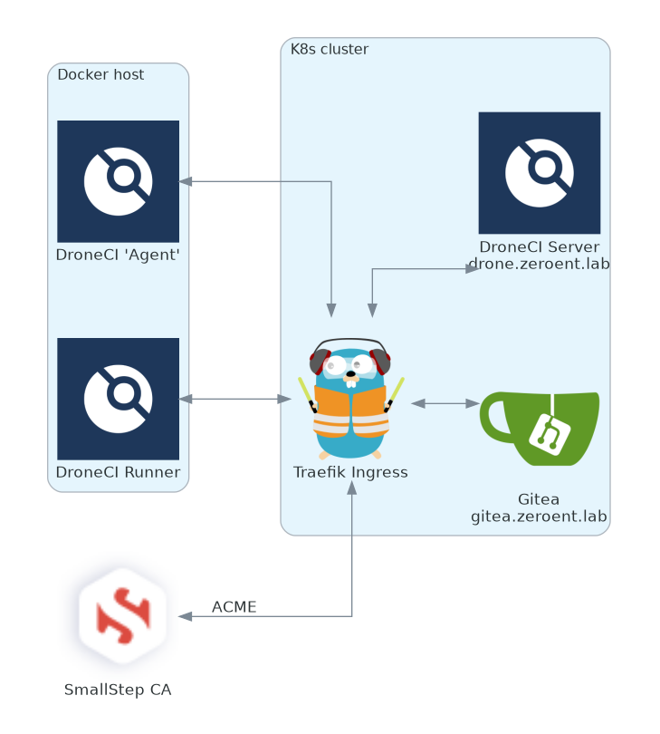

## Problem
In my lab, I deployed my own ACME Certificate Authority using [SmallStep](https://hub.docker.com/r/smallstep/step-ca) (a post for another day).  It signs all (valid) requests for the internal lab.  The problem is, any container I pull down obviously won't have my custom CA cert loaded into the containers trust store, there are quite a few places where you're going to need to load in this cert.

It should be noted, that I chose to route everything through my Traefik Ingress Controller so everybody would be talking TLS to everybody else.

## Topology
I've got Gitea and DroneCI running behind a Traefik proxy that pulls from the internal ACME CA.  Gitea, DroneCI, and Traefik are all running on a Kubernetes (k8s) cluster, but for the purposes of this discussion (largely) it doesn't matter.  This post will assume you already have your Reverse Proxy/Ingress Controller plumbed up to trust your internal ACME CA.

Some of the suggestions for the Gitea/DroneCI container will be k8s manifests, but you can easily adapt them to docker; the problems and the ideas are all the same.



A couple points of clarification about the diagram above:
- `DroneCI 'Agent'` is the docker container you spin up manually that connects out to the main `DroneCI server`
- `DroneCI Runner` are the containers that get *dynamically* spun up by the `DroneCI 'Agent'` that run the actual pipeline.

Anywhere in this tutorial where you see reference to "ca-chain.crt"; that is my SmallStep CA's root and intermediate cert.  Source yours accordingly if you've generated them differently.

Lets walk through each problem as you're likely (at least how I) encounter it.

## DroneCI -> Gitea
When you're initially setting up [Gitea to talk to Drone](https://docs.drone.io/server/provider/gitea/), you need to setup an OAUTH connection.  Once you've configured OAUTH in Gitea, you'll try to navigate to your DroneCI server's web UI only to be met with:

```
Login Failed. Post "https://gitea.zeroent.lab/login/oauth/access_token": x509: certificate signed by unknown authority
```

To remedy this, DroneCI needs to trust the root CA that signed everything.


Create a `ConfigMap` containing your root certs:
```bash
kubectl create configmap acmecerts --from-file=ca_chain.crt=ca_chain.crt --namespace=droneci
```

and include the following values in your DroneCI helm chart (and update/re-deploy as necessary):
```yaml
extraVolumes:
  - configMap:
      defaultMode: 420
      name: acmecerts
    name: acmecerts
extraVolumeMounts:
  - mountPath: /etc/ssl/certs/ca-certificates.crt
    name: acmecerts
    readOnly: true
    subPath: ca_chain.crt
```
> Note that I'm overwriting the containers trust-store of `/etc/ssl/certs/ca-certificates.crt`.  
> 
> By default, Drone's containers don't import any certs found in `/etc/ssl/certs` and I didn't feel like re-building their container to include my CA.  
> 
> Additionally the helm chart doesn't include any provisions for "scripts to run on boot" or "init containers", so this was my last recourse.  Given I'm never going to have this DroneCI server reach out to anything that isn't signed by my own CA, its not a problem, but Caveat Emptor.

### Gitea -> DroneCI
Once you get logged into the DroneCI UI, you can activate a repo.  This will setup a webhook on the repo in Gitea.  Go to that hook, and run a "Test Delivery" (found at the bottom of the page under Repo Settings > Webhooks ).

It'll likely fail, with the following error in the response tab:

```
Delivery: Post "https://drone.zeroent.lab/hook?secret=abcdefg123456789": x509: certificate signed by unknown authority
```

To fix this, Gitea needs to know about the root CA.  Thankfully the image that Gitea uses scoops up all certs defined in `/etc/ssl/certs/` and includes them in the cert-store on start.  All we need to do is create a `ConfigMap` with our certs (in gitea's namespace), and mount them in the container:

Create the `ConfigMap`
```bash
kubectl create configmap acmecerts --from-file=ca_chain.crt=ca_chain.crt --namespace=gitea
```

> Note: If you have Gitea and DroneCI in the same namespace, you don't need to create the `ConfigMap` again.


and include the following values in your Gitea helm chart (and update/re-deploy as necessary):
```yaml
extraVolumes:
  - configMap:
      defaultMode: 420
      name: acmecerts
    name: acmecerts
extraVolumeMounts:
  - mountPath: /etc/ssl/certs/acme-chain.crt
    name: acmecerts
    readOnly: true
    subPath: ca_chain.crt
```

Not overriding `/etc/ssl/certs/ca-certs.crt` (like we did with Drone) allows Gitea to trust anything in its "factory" cert store **and** our CA. 🥳

If you want, feel free to test the webhook now, you should get a success!

### DroneCI Agent -> DroneCI Server and DroneCI Runner -> Gitea

You guessed it, when you try to launch a DroneCI 'Agent' or the 'Runners' the agent spawns, they need to trust the CA as well.  In my setup, I'm just using the DroneCI Docker Runner.

If your agent doesn't trust the CA, you'll see something like this in the docker runner logs:

```
time="2022-02-26T19:25:13Z" level=error msg="cannot ping the remote server" error="Post \"https://drone.zeroent.lab/rpc/v2/ping\": x509: certificate signed by unknown authority"
```

And if your DroneCI 'Runner' doesn't trust the CA, you'll see the following in your pipeline when it tries to fire off a pipeline:
```
Initialized empty Git repository in /drone/src/.git/
+ git fetch origin +refs/heads/master:
fatal: unable to access 'https://gitea.zeroent.lab/mike/Notes.git/': SSL certificate problem: unable to get local issuer certificate
```

To fix this, both the DroneCI Agent and the DroneCI Runner need to trust the CA. My CA is running on the same docker host as the DroneCI runners/agent, so it was easy to mount in the CA chain, otherwise just copy it to your runner host and change the `/opt/dockervol/step-ca/pub` path to yours:


```bash
docker run --detach \
  --volume=/var/run/docker.sock:/var/run/docker.sock \
  --volume=/opt/dockervol/step-ca/pub/ca_chain.crt:/etc/ssl/certs/ca-certificates.crt \ # for the DroneCI Agent
  --env=DRONE_RUNNER_VOLUMES=/opt/dockervol/step-ca/pub/ca_chain.crt:/etc/ssl/certs/ca-certificates.crt \ # for the DroneCI Runner
  --env=DRONE_RPC_PROTO=https \
  --env=DRONE_RPC_HOST=drone.zeroent.lab \
  --env=DRONE_RPC_SECRET=asdf1234asdf12341234 \
  --env=DRONE_RUNNER_CAPACITY=2 \
  --env=DRONE_RUNNER_NAME=docker01-runner1 \
  --env=skip_verify=true \
  --publish=3000:3000 \
  --restart=always \
  --name=runner \
  drone/drone-runner-docker:1
```
Re-run your failed pipeline and you should get success (well, TLS will work anyways)!

## Additional things I ran into
Initially I thought I'd be slick and tried to configure DroneCI to use the internal k8s service name for Gitea (since they were running on the same cluster), but that caused some problems when logging in;  DroneCI uses the `DRONE_GITEA_SERVER` value on where to go for OAUTH, and for some reason, the browser on my desktop couldn't resolve `gitea-http.gitea.svc.cluster.local` 🤔... 

`</sarcasm>`

That, combined with the fact that I wanted (trusted) TLS for everything, made it easier to just send it all through Traefik.

## Summary
This was quite an adventure, hopefully somebody else can find this and solve their problems rather than just turning off cert validation (booooo).  It should be noted that my `ca-chain.crt` contains both my Root CA cert and my Intermediate CA cert.  

I've had issues in the past where clients (or other applications) didn't traverse the chain without it being spelled out in crayon and I didn't feel like messing with it here.  Understanding that if you include your Intermediate, you'll have to update your `ca-chain.crt` in the event you generate a new Intermediate cert (compromise, rotation, etc).

## Sources
- Helpful [StackOverflow](https://stackoverflow.com/questions/36199249/add-ca-certificate-to-drone-io-build-container-such-that-git-fetch-can-use-it)
- https://discourse.drone.io/t/ssl-certificate-problem-unable-to-get-local-issuer-certificate/6852
- https://discourse.drone.io/t/drone-agent-cant-connect-over-wss-x509-certificate-signed-by-unknown-authority-error/463


#### Legal
All product and company names are trademarks™ or registered® trademarks of their respective holders. Use of them does not imply any affiliation with or endorsement by them. 

Bus image is derived from works by [Noah Mormino as hosted on the Noun Project](https://thenounproject.com/icon/bus-114499/)